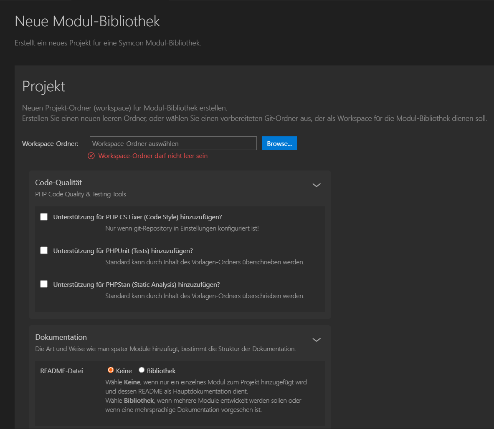
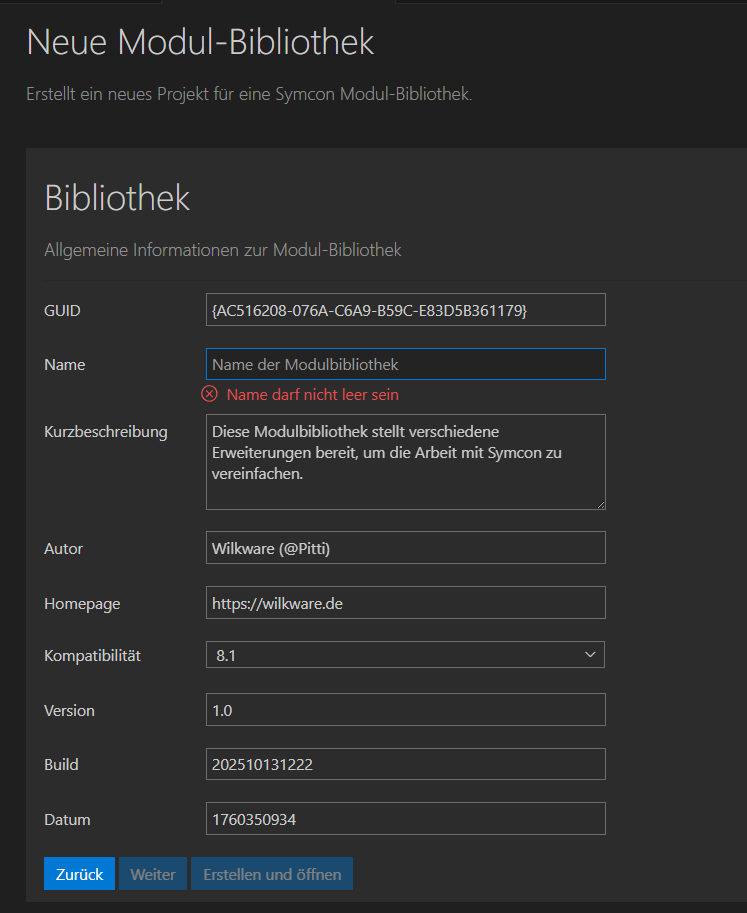
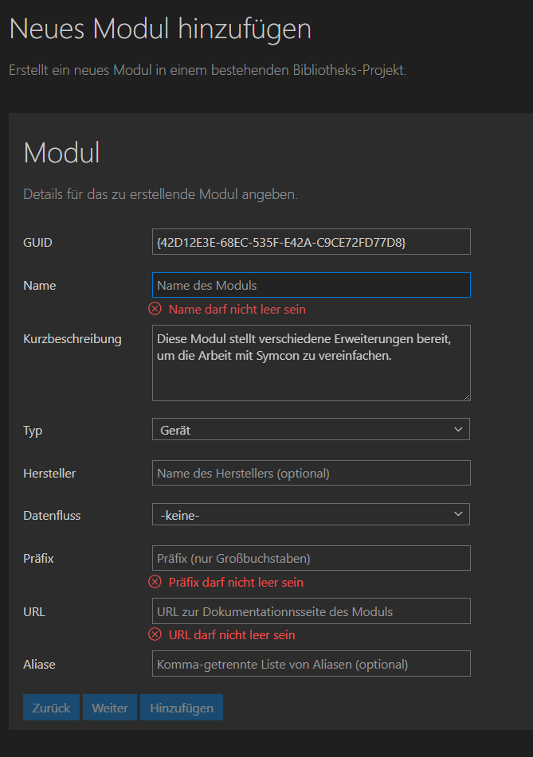
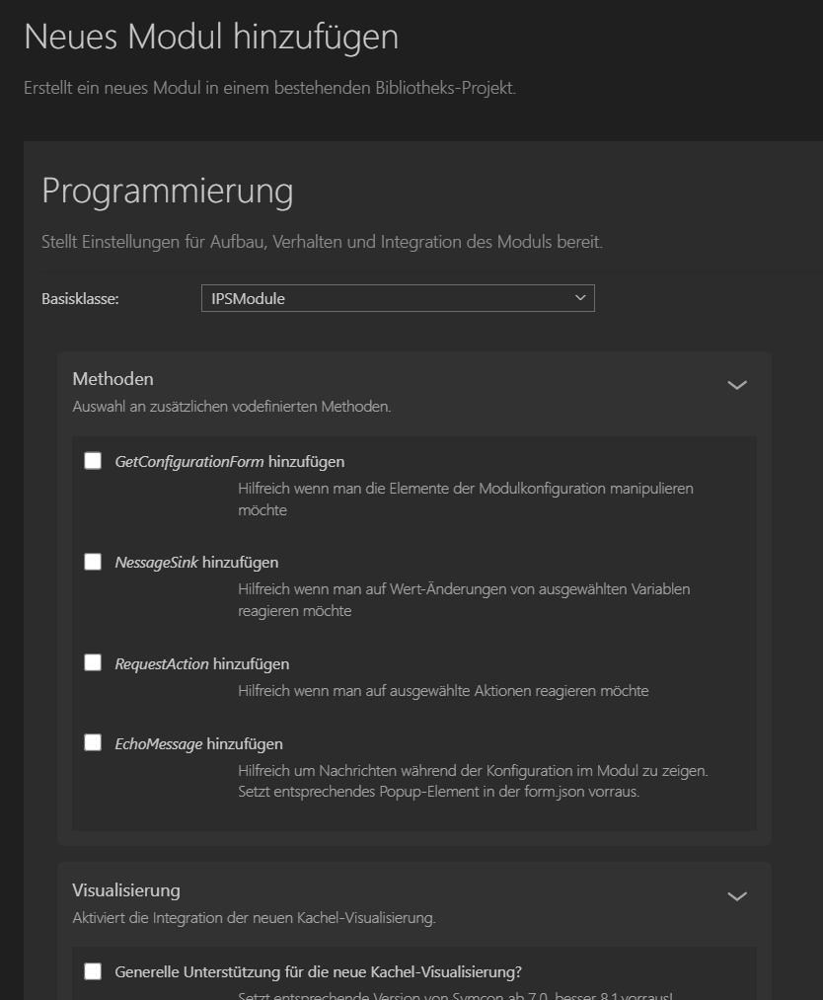
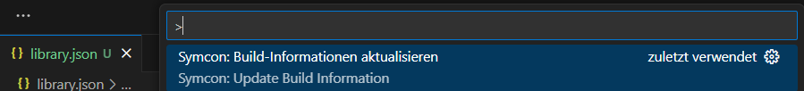
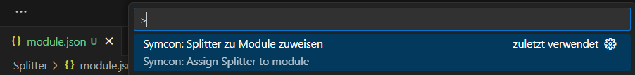
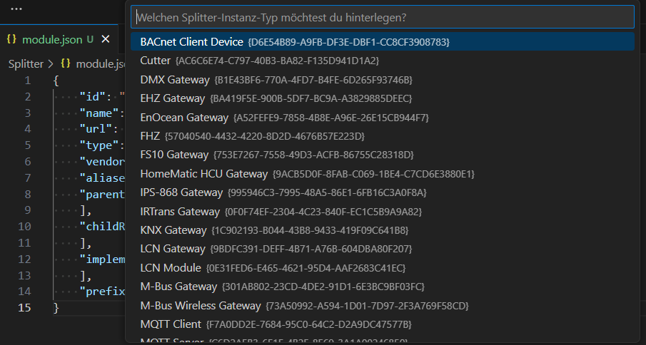

# 🧩 Symcon Modul Helfer (Symcon Module Helper)

## Deutsch DE

### Symcon Modul Helfer

Der **Symcon Modul Helfer** ist eine umfassende Visual Studio Code Extension zur komfortablen **Entwicklung von Symcon-Modulen** und Bibliotheken.  
Er beschleunigt das **Erstellen, Testen und Pflegen** von *form.json*-Konfigurationen und vereint Code-Generator, Formular-Editor, Projekt-Wizard und Live-Preview in einer einzigen Oberfläche. Mit nur wenigen Klicks können komplette **Symcon-Bibliotheken** oder **Module** generiert, bestehende Projekte gepflegt und automatisch mit GUIDs, Build-Informationen und Dokumentation versehen werden.

### ✨ Hauptfunktionen

#### Wizards & Generatoren
- **Library Generator Wizard** → Erstellt neue Symcon-Bibliotheksprojekte  
- **Module Generator Wizard** → Fügt neue Module zu bestehenden Bibliotheken hinzu  
- **Benutzerdefinierte Templates**: eigener Vorlagen-Ordner konfigurierbar  
- **Readme-Patching** → erweitert Dokumentationslisten beim Hinzufügen neuer Module  
- Intelligentes Feld-Mapping, Modul-Validierung und automatische GUID-Vergabe  

#### Formular- und Editor-Funktionen
- Schnelles Einfügen von **Symcon Formular-Elementen** per Klick  
- Automatisch erzeugte, **korrekt formatierte JSON-Snippets**  
- **Sidebar-Editor** zur Anzeige und Bearbeitung aller Eigenschaften  
- Unterstützung aller **Standard-Elementtypen** des Symcon PHP-SDK  

#### Live Preview
- Echtzeit-Vorschau (HTML, JSON, Theme, Größe) im eingebetteten Webview  
- **Persistente Einstellungen** (Theme, Breite, Höhe) pro Workspace  
- Preview-JSON speichern, laden und direkt an das iFrame senden  

#### Hilfs- und Analysefunktionen
- **Build Info Command** → Aktualisiert *library.json* (Buildnummer + Datum)  
- **Splitter GUID Command** → Weist gültige GUIDs in *module.json* zu  
- **Übersetzen** von *form.json* → *locale.json*  
- **Extraktion und Registrierung** von Property-Variablen in *Create()*  

### 🧰 Installation

- Verfügbar im Visual Studio Marketplace  
    1. Öffne **Visual Studio Code**  
    2. Gehe zu **Erweiterungen (CTRL + SHIFT + X)**  
    3. Suche nach **"Symcon Modul Helfer"**  
    4. Klicke auf **Installieren**
- Alternativ: Manuelle Installation der `.vsix` Datei via `Extensions: Install from VSIX...`  

### 💡 Verwendung

1. [Assitenten](#user-content-1-assitenten)
2. [Formulare](#user-content-2-formulare)
3. [Live Vorschau](#user-content-3-live-vorschau)
4. [Funktionen](#user-content-4-funktionen)

#### 1. Assitenten

##### 1.1. Neues Projekt

* Über die Befehlspalette ... (Strg + Umschalt + P)  
* `Neues Projekt für eine Modulbibliothek erstellen (über Assistent)` auswählen  
* Der **Projekt Assizent** wird geöffent ...  

     
   <!-- Screenshot: Neues Projekt Assistent -->

* Nimm die entsprechenden Einstellungen vor und drücke auf `Weiter`  
* Die **Bibliotheks-Seite** wird geöffnet ...  

     
   <!-- Screenshot: Neue Bibliothek Seite -->

* Nimm die entsprechenden Einstellungen vor und drücke auf `Erstellen und öffnen`  
* Ferig — VSCode öffent automatisch das neu Projekt!  

##### 1.2. Neues Modul

* Über die Befehlspalette ... (Strg + Umschalt + P)  
* `Neues Modul hinzufügen (über Assistent)` auswählen  
* Der **Modul Assizent** wird geöffent ...  

     
   <!-- Screenshot: Neues Modul Assistent -->

* Nimm die entsprechenden Einstellungen vor und drücke auf `Weiter`  
* Die **Programmierungs-Seite** wird geöffnet ...  

     
   <!-- Screenshot: Programmierung Seite -->

* Nimm die entsprechenden Einstellungen vor und drücke auf `Hinzufügen`  
* Ferig — das neue Modul wird dem aktuellen Projekt (Bibliothek) hinzugefügt!  

#### 2. Formulare

* Öffne eine `forms.json` Datei im Projekt  
* Die Symcon Form Sidebar wird automatisch angezeigt  

     
   <!-- Screenshot: Sidebar mit Liste der Formular-Elemente -->

* Positioniere den Cursor an die gewünschte Stelle im JSON (z.B. nach einer schließenden Klammer eines Elements)  

* Wähle in der Sidebar ein Formular-Element aus  

     
   <!-- Screenshot: Formular zur Eingabe der Eigenschaften -->

* Fülle die Eigenschaften im Formular aus  

* Klicke auf „Element einfügen“  

* Fertig — das Element wird korrekt und formatiert im JSON eingefügt!  

     
   <!-- Screenshot: Beispiel JSON nach dem Einfügen -->

#### 3. Live Vorschau

* Öffne die Erweiterungseinstellungen nimm die entsprechenden Einstellungen vor  

     
   <!-- Screenshot: Settings for live preview -->

* Wechseln zur Datei „module.html“ und drücken (Strg + Umschalt + P) ...  

     
   <!-- Screenshot: Call up the command palette -->

* Oder öffnen Sie das Kontextmenü (Rechtsklick)  

     
   <!-- Screenshot: Context menu -->

* Fertig – die Symcon-Live-Vorschau wird angezeigt!  

     
   <!-- Screenshot: Live preview -->

#### 4. Funktionen

##### 4.1. Übersetzungen

* Markiere den zu übersetzenden Text in der form.json Datei und aktiviere das Kontext-Menü (rechte Maustaste)  

     
   <!-- Screenshot: Context Menü für Übersetzung -->

* Klicke auf "Übersetzung zur `locale.json` hinzufügen"  

* Gib deine Übersetzung in den Dialog ein ...  

     
   <!-- Screenshot: Eingabe der Übersewtzung -->

* Fertig — eine neue Zeile wurde zur `locale.json`  hinzugefügt!  

##### 4.2. Registrierungen

* Wechseln in die `module.php` Datei und drücke (Strg + Umschalt + P) ...  

     
   <!-- Screenshot: Aufruf Befehlspalette -->

* Wähle "Füge RegisterProperty-Aufrufe in Create() ein." aus!  

* Fertig – für alle in form.json definierten Eigenschaften wird ein RegisterProperty-Aufruf in die create-Methode von module.php eingefügt!  

##### 4.3. Build Informationen

* Wechseln in die `libaray.json` Datei und drücke (Strg + Umschalt + P) oder rechte Maustaste ...  

     
   <!-- Screenshot: Aufruf Befehlspalette -->

* Wähle "Build-Informationen aktualisieren" aus!  

* Gib einen möglichen Versatz an Tagen ein (falls nicht aktueller Tag herangezogen werden soll) ...  

     
   <!-- Screenshot: Eingabe des Versatzes in Tagen -->

* Fertig – die Attribute `build` und `date` haben einen aktualisierten Wert!  

##### 4.4. Splitter zuweisen

* Wechseln in die `module.json` Datei und drücke (Strg + Umschalt + P) oder rechte Maustaste ...  

     
   <!-- Screenshot: Aufruf Befehlspalette -->

* Wähle "Splitter zu Modul zuweisen" aus!  

* Wähle einen der aufgelisteten Splitter aus der Liste aus ...  

     
   <!-- Screenshot: Lister der verfügbaren Splitter -->

* Fertig – die entsprechenden GUIDs werden zur `module.json` hinzugefügt!  

---

## English EN

### Symcon Module Helper

The **Symcon Module Helper** is a comprehensive Visual Studio Code extension for convenient **development of Symcon modules** and libraries.  
It speeds up the **creation, testing and maintenance** of *form.json* configurations and combines a code generator, form editor, project wizard and live preview in a single interface. With just a few clicks, you can generate complete **Symcon libraries** or **modules**, maintain existing projects and automatically add GUIDs, build information and documentation.

### ✨ Main features

#### Wizards & generators
- **Library Generator Wizard** → Creates new Symcon library projects  
- **Module Generator Wizard** → Adds new modules to existing libraries
- **Custom templates**: configurable template folder
- **Readme patching** → Extends documentation lists when adding new modules
- Intelligent field mapping, module validation, and automatic GUID assignment  

#### Form and editor functions
- Quick insertion of **Symcon form elements** with a single click  
- Automatically generated, **correctly formatted JSON snippets**  
- **Sidebar editor** for displaying and editing all properties  
- Support for all **standard element types** of the Symcon PHP SDK  

#### Live preview
- Real-time preview (HTML, JSON, theme, size) in embedded web view  
- **Persistent settings** (theme, width, height) per workspace  
- Save, load and send preview JSON directly to the iFrame  

#### Help and analysis functions
- **Build Info Command** → Updates *library.json* (build number + date)  
- **Splitter GUID Command** → Assigns valid GUIDs in *module.json*  
- **Translate** from *form.json* → *locale.json*  
- **Extraction and registration** of property variables in *Create()*  

### 🧰 Installation

- Available in the Visual Studio Marketplace  
    1. Open **Visual Studio Code**
    2. Go to **Extensions (CTRL + SHIFT + X)**
    3. Search for **‘Symcon Module Helper’**
    4. Click **Install**
- Alternatively: Manually install the `.vsix` file via `Extensions: Install from VSIX...`  

### 💡 Usage

1. [Wizards](#user-content-1-wizards)
2. [Forms](#user-content-2-forms)
3. [Live Preview](#user-content-3-live-preview)
4. [Functions](#user-content-4-functions)

#### 1. Wizards

##### 1.1. New Project

* Via the command palette (Ctrl + Shift + P) ...  
* Select `Create new project for a module library (via wizard)`  
* The **Project Wizard** opens ...  

     
   <!-- Screenshot: New Project Wizard -->

* Make the appropriate settings and press `Next`  
* The **Library page** opens ...  

     
   <!-- Screenshot: New library page -->

* Make the appropriate settings and press `Create and open`  
* Done — VSCode automatically opens the new project!  

##### 1.2. New Module

* Via the command palette (Ctrl + Shift + P) ...  
* Select `Add New Module (via Wizard)`  
* The **Module Wizard** will open ...  

     
   <!-- Screenshot: New Module Wizard -->

* Make the appropriate settings and click `Next`  
* The `Code` page opens ...  

     
   <!-- Screenshot: Code page -->

* Make the appropriate settings and click on ‘Add’.  
* Done – the new module is added to the current project (library)!  

#### 2. Forms

* Open a `forms.json` file in your project  
* The Symcon form sidebar appears automatically  

     
   <!-- Screenshot: Sidebar with list of form elements -->

* Place the cursor where you want to insert a new element (e.g., after a closing brace of the previous element)  

* Select a form element in the sidebar  

     
   <!-- Screenshot: Form for entering element properties -->

* Fill out the properties in the form  

* Click the "Insert Element" button  

* Done — the element is inserted correctly formatted in the JSON  

     
   <!-- Screenshot: Example JSON after insertion -->

#### 3. Live Preview

* Open the extension settings and configure the appropriate settings.

     
   <!-- Screenshot: Settings for live preview -->

* Switch to the file ‘module.html’ and press (Ctrl + Shift + P).

     
   <!-- Screenshot: Call up the command palette -->

* Or open the context menu (right-click)  

     
   <!-- Screenshot: Context menu -->

* Done – the Symcon live preview is displayed.  

     
   <!-- Screenshot: Live preview -->

#### 4. Functions

##### 4.1. Translation

* Select the text you want to translate in the form.json file and open the context menu (right-click)  

     
   <!-- Screenshot: Context menu -->

* Click on "Add translation to locale.json"  

* Enter your translation in the input dialog ...

     
   <!-- Screenshot: Enter translation text -->

* Done — a new line has been added to locale.json!  

##### 4.2. Registration

* Switch to the module.php file and press (Ctrl + Shift + P).

     
   <!-- Screenshot: Call up the command palette -->

* Select "Insert RegisterProperty calls into Create()." ...

* Done – for all properties defined in `form.json`, a RegisterProperty call is inserted into the create method of `module.php`!

##### 4.3. Build Information

* Switch to the `libaray.json` file and press (Ctrl + Shift + P) or right-click ...

     
   <!-- Screenshot: Call up the command palette -->

* Select ‘Update build information’!  

* Enter a possible offset in days (if the current day is not to be used) ...

     
   <!-- Screenshot: Input offset in days -->

* Done – the attributes `build` and `date` have an updated value!

##### 4.4. Assign splitter

* Switch to the `module.json` file and press (Ctrl + Shift + P) or right-click ...

     
   <!-- Screenshot: Call up the command palette -->

* Select `Assign splitter to module`!  

* Select one of the listed splitters from the list...

     
   <!-- Screenshot: List of available splitters -->

* Done – the corresponding GUIDs are added to `module.json`!

---

### 🧑‍💻 Target Audience

This extension is targeted at developers of Symcon modules using the PHP SDK.

---

## 📌 Feedback & Contributions

Contributions and feedback are very welcome! Feel free to open issues or pull requests on the [GitHub repository](https://github.com/Wilkware/vscode-forminator).

---

## 👨‍💻 About me

I’ve been passionate about home automation for over 10 years.
Lately, I’ve been actively contributing to the IP-Symcon community with various scripts and modules.
You can find me there under @pitti ;-)

This extension is a small way for me to share some of that experience with the community.

## 💰 Donate

This software is free to use for non-commercial purposes.
If you enjoy using it and would like to support ongoing development, a small donation would be sincerely appreciated.

## ©️ Lizenz

© Wilkware, 2025. Licensed under CC BY-NC-SA 4.0.  
You may share and adapt this work non-commercially with attribution and under the same license. 

