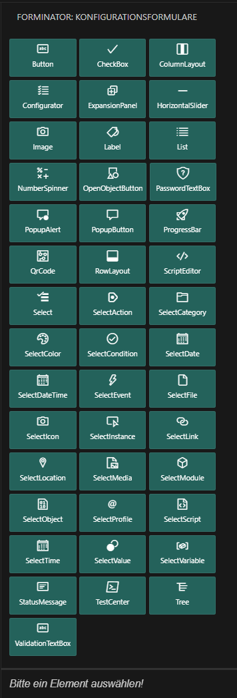
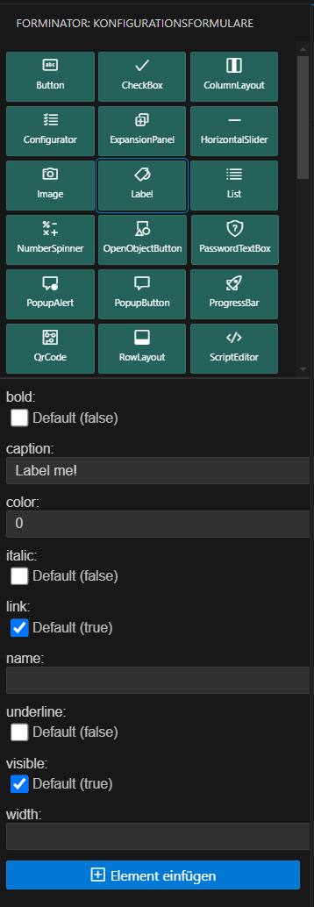
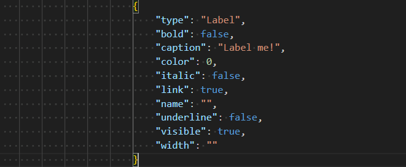
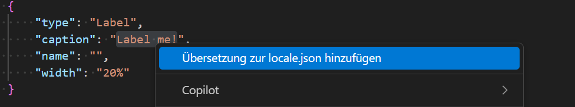
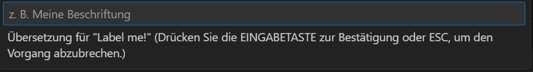
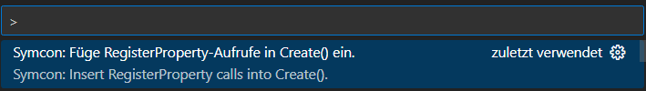
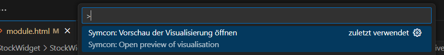
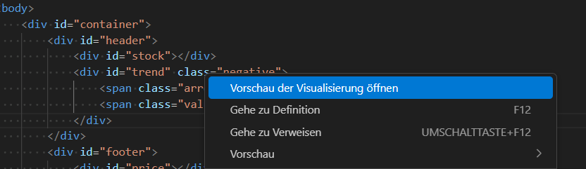

# Forminator — Symcon Formular Helfer / Form Helper

## Deutsch DE

### Was ist Forminator?

Forminator ist eine Visual Studio Code Extension, die das einfache Einfügen von Symcon Konfigurationsformular-Elementen (`form.json`) direkt über die Sidebar ermöglicht. Sie richtet sich an Symcon Modul Entwickler, die ihre Formulare effizienter erstellen und bearbeiten wollen.

### Hauptfunktionen

- Schnelles Einfügen von Symcon Formular-Elementen per Klick  
- Automatisches Einfügen passender JSON-Snippets mit korrekter Syntax  
- Anzeige und Bearbeitung aller Eigenschaften des ausgewählten Elements im Sidebar-Formular  
- Unterstützung aller Standard-Elementtypen aus dem Symcon PHP SDK  
- Einfaches Handling der Formulardaten ohne manuelles Tippen
- Kontextmenü-Erweiterung zum Übersetzen von Texten direkt aus der form.json in die locale.json
- Befehl (Strg + Umschalt + P) zum Auslesen aller Property-Variablen aus der form.json und registrieren in der Create()-Methode der module.php 
- Live Preview: Direkte Visualisierung der Kachel/Module im Webview während der Bearbeitung – Änderungen am HTML, JSON oder Theme werden sofort übernommen.

### Installation

- Verfügbar im Visual Studio Marketplace  
- Alternativ: Manuelle Installation der `.vsix` Datei via `Extensions: Install from VSIX...`

### Verwendung

1. [Formulare](#user-content-1-formulare)
2. [Übersetzungen](#user-content-2-uebersetzungen)
3. [Registrierungen](#user-content-3-Registrierungen)
4. [Live Vorschau](#user-content-8-livevorschau)

#### 1. Formulare

* Öffne eine `forms.json` Datei im Projekt  
* Die Forminator Sidebar wird automatisch angezeigt  

     
   <!-- Screenshot: Sidebar mit Liste der Formular-Elemente -->

* Positioniere den Cursor an die gewünschte Stelle im JSON (z.B. nach einer schließenden Klammer eines Elements)  

* Wähle in der Sidebar ein Formular-Element aus  

     
   <!-- Screenshot: Formular zur Eingabe der Eigenschaften -->

* Fülle die Eigenschaften im Formular aus  

* Klicke auf „Element einfügen“  

* Fertig — das Element wird korrekt und formatiert im JSON eingefügt  

     
   <!-- Screenshot: Beispiel JSON nach dem Einfügen -->

#### 2. Übersetzungen

* Markiere den zu übersetzenden Text in der form.json Datei und aktiviere das Kontext-Menü (rechte Maustaste)  

     
   <!-- Screenshot: Context Menü für Übersetzung -->

* Klicke auf "Übersetzung zur locale.json hinzufügen"  

* Gib deine Übersetzung in den Dialog ein ...

     
   <!-- Screenshot: Eingabe der Übersewtzung -->

* Fertig — eine neue Zeile wurde zur locale.json hinzugefügt!

#### 3. Registrierungen

* Wechseln in die module.php Datei und drücke (Strg + Umschalt + P)

     
   <!-- Screenshot: Aufruf Befehlspalette -->

* Wähle "Füge RegisterProperty-Aufrufe in Create() ein." aus!  

* Fertig – für alle in form.json definierten Eigenschaften wird ein RegisterProperty-Aufruf in die create-Methode von module.php eingefügt!

#### 4. Live Preview

* Wechseln zur Datei „module.html“ und drücken (Strg + Umschalt + P).

     
   <!-- Screenshot: Call up the command palette -->

* Oder öffnen Sie das Kontextmenü (Rechtsklick)

     
   <!-- Screenshot: Context menu -->

* Fertig – die Symcon-Live-Vorschau wurde angezeigt.

     
   <!-- Screenshot: Live preview -->

### Zielgruppe

Diese Extension richtet sich an Entwickler von Symcon Modulen, die das PHP SDK nutzen.

---

## English EN

### What is Forminator?

Forminator is a Visual Studio Code extension for easily inserting Symcon configuration form elements (`form.json`) directly from the sidebar. It is designed for Symcon module developers who want to build and edit their forms more efficiently.

### Main Features

- Quick insertion of Symcon form elements with a click  
- Automatic insertion of proper JSON snippets with correct syntax  
- Sidebar form to display and edit all properties of the selected element  
- Support for many standard element types from the Symcon PHP SDK  
- Easy handling of form data without manual typing
- Context menu extension for translating text values directly from form.json into locale.json
- Command (Ctrl + Shift + P) to read all property variables from form.json and register them in the Create() method of module.php
- Live Preview: Immediate visualization of the tile/module in the Webview while editing – changes to HTML, JSON, or theme are applied instantly.

### Installation

- Available on the Visual Studio Marketplace  
- Alternatively, install manually from the `.vsix` file using `Extensions: Install from VSIX...`

### Usage

1. [Forms](#user-content-1-forms)
2. [Translation](#user-content-2-translation)
3. [Registration](#user-content-3-registration)
4. [Live Preview](#user-content-8-livepreview)

#### 1. Forms

* Open a `forms.json` file in your project  
* The Forminator sidebar appears automatically  

     
   <!-- Screenshot: Sidebar with list of form elements -->

* Place the cursor where you want to insert a new element (e.g., after a closing brace of the previous element)  

* Select a form element in the sidebar  

     
   <!-- Screenshot: Form for entering element properties -->

* Fill out the properties in the form  

* Click the "Insert Element" button  

* Done — the element is inserted correctly formatted in the JSON  

     
   <!-- Screenshot: Example JSON after insertion -->

#### 2. Translation

* Select the text you want to translate in the form.json file and open the context menu (right-click)  

     
   <!-- Screenshot: Context menu -->

* Click on "Add translation to locale.json"  

* Enter your translation in the input dialog ...

     
   <!-- Screenshot: Enter translation text -->

* Done — a new line has been added to locale.json!  

#### 3. Registration

* Switch to the module.php file and press (Ctrl + Shift + P).

     
   <!-- Screenshot: Call up the command palette -->

### Target Audience

This extension is targeted at developers of Symcon modules using the PHP SDK.

---

## Feedback & Contributions

Contributions and feedback are very welcome! Feel free to open issues or pull requests on the [GitHub repository](https://github.com/Wilkware/vscode-forminator).

---

## License

CC BY--NC--SA 4.0 © Wilkware
