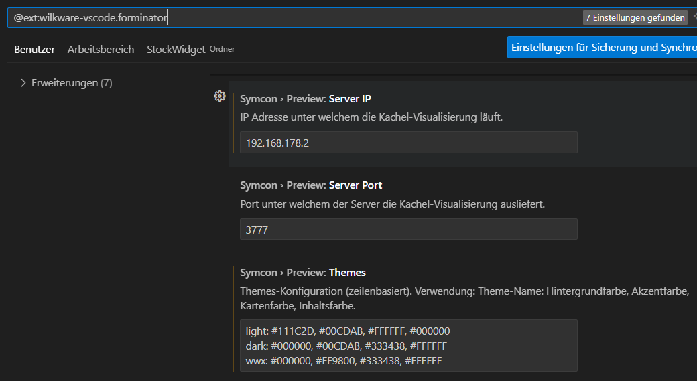

# ⚙️ Symcon Modul Helfer (Symcon Module Helper)

## Deutsch DE

### Symcon Modul Helfer

Der Symcon Module Helper ist eine Visual Studio Code Extension für Symcon-Modulentwicklung, die das Erstellen, Testen und Pflegen von form.json-Konfigurationen massiv beschleunigt. Sie bietet: schnelles Einfügen von Formular-Elementen und automatisch generierte JSON-Snippets mit korrekter Syntax, eine Sidebar zur Anzeige und Bearbeitung aller Eigenschaften eines ausgewählten Elements, Unterstützung der Standard-Elementtypen des Symcon PHP-SDK sowie komfortables Handling der Formulardaten (Live-Bearbeitung ohne viel Tipparbeit).

Zusätzlich enthält der Symcon Modul Helfer eine Echtzeit-Vorschau (Live Preview) – Theme, Größe, HTML und Payload werden sofort in einem eingebetteten Webview aktualisiert — inklusive persistenter Preview-Einstellungen pro Workspace, Inline-Patch des Module-HTMLs und sicherer CSP-/Ressourcensteuerung.

Ergänzende Features: Kontextmenü-Erweiterung zum Übersetzten von Texten aus form.json in locale.json, ein Kommando zum Auslesen und Registrieren aller Property-Variablen in der Create()-Methode der module.php, sowie einfache Speicherung und Wiederherstellung von Preview-JSON.

### Hauptfunktionen

- Schnelles Einfügen von Symcon Formular-Elementen per Klick
- Automatisch erzeugte, korrekt formatierte JSON-Snippets
- Sidebar-Editor: alle Eigenschaften eines Elements anzeigen & bearbeiten
- Unterstützung aller Standard-Elementtypen des Symcon PHP-SDK
- Live Preview: sofortige Visualisierung von HTML, JSON, Theme und Größe im Webview
- Persistente Preview-Einstellungen (Theme, Breite, Höhe) pro Workspace
- Preview-JSON speichern/laden, live an das iFrame senden (postMessage)
- Kontextmenü zum Übersetzen direkt aus form.json in locale.json
- Kommando zum Extrahieren von Property-Variablen und Registrieren in Create()

### Installation

- Verfügbar im Visual Studio Marketplace  
- Alternativ: Manuelle Installation der `.vsix` Datei via `Extensions: Install from VSIX...`

### Verwendung

1. [Formulare](#user-content-1-formulare)
2. [Übersetzungen](#user-content-2-übersetzungen)
3. [Registrierungen](#user-content-3-registrierungen)
4. [Live Vorschau](#user-content-4-live-vorschau)

#### 1. Formulare

* Öffne eine `forms.json` Datei im Projekt  
* Die Symcon Form Sidebar wird automatisch angezeigt  

     
   <!-- Screenshot: Sidebar mit Liste der Formular-Elemente -->

* Positioniere den Cursor an die gewünschte Stelle im JSON (z.B. nach einer schließenden Klammer eines Elements)  

* Wähle in der Sidebar ein Formular-Element aus  

     
   <!-- Screenshot: Formular zur Eingabe der Eigenschaften -->

* Fülle die Eigenschaften im Formular aus  

* Klicke auf „Element einfügen“  

* Fertig — das Element wird korrekt und formatiert im JSON eingefügt  

     
   <!-- Screenshot: Beispiel JSON nach dem Einfügen -->

#### 2. Übersetzungen

* Markiere den zu übersetzenden Text in der form.json Datei und aktiviere das Kontext-Menü (rechte Maustaste)  

     
   <!-- Screenshot: Context Menü für Übersetzung -->

* Klicke auf "Übersetzung zur locale.json hinzufügen"  

* Gib deine Übersetzung in den Dialog ein ...

     
   <!-- Screenshot: Eingabe der Übersewtzung -->

* Fertig — eine neue Zeile wurde zur locale.json hinzugefügt!

#### 3. Registrierungen

* Wechseln in die module.php Datei und drücke (Strg + Umschalt + P)

     
   <!-- Screenshot: Aufruf Befehlspalette -->

* Wähle "Füge RegisterProperty-Aufrufe in Create() ein." aus!  

* Fertig – für alle in form.json definierten Eigenschaften wird ein RegisterProperty-Aufruf in die create-Methode von module.php eingefügt!

#### 4. Live Vorschau

* Öffne die Erweiterungseinstellungen nimm die entsprechenden Einstellungen vor

     
   <!-- Screenshot: Settings for live preview -->

* Wechseln zur Datei „module.html“ und drücken (Strg + Umschalt + P).

     
   <!-- Screenshot: Call up the command palette -->

* Oder öffnen Sie das Kontextmenü (Rechtsklick)

     
   <!-- Screenshot: Context menu -->

* Fertig – die Symcon-Live-Vorschau wird angezeigt.

     
   <!-- Screenshot: Live preview -->

### Zielgruppe

Diese Extension richtet sich an Entwickler von Symcon Modulen, die das PHP SDK nutzen.

---

## English EN

### Symcon Module Helper

The Symcon Module Helper is a Visual Studio Code extension for Symcon module development that makes creating, testing, and maintaining form.json configuration files faster and more convenient.
It allows you to quickly insert form elements with a single click, generates correctly formatted JSON snippets automatically, and provides a sidebar editor to view and edit the properties of any selected element.

It supports all standard element types from the Symcon PHP SDK and simplifies handling form data without tedious manual typing.
The Symcon Module Helper also includes a real-time live preview — instantly updating your Webview as you modify HTML, JSON, themes, or dimensions. Preview settings (theme, width, height) are saved per workspace for a consistent workflow.

Additional features include inline HTML patching with secure CSP handling, context menu integration to translate texts from form.json to locale.json, and commands to extract and register property variables in the Create() method of your module.php.

### Main Features

- One-click insertion of Symcon form elements
- Automatically generated and properly formatted JSON snippets
- Sidebar editor to view and modify all properties of selected elements
- Full support for all standard element types from the Symcon PHP SDK
- Live Preview: real-time visualization of HTML, JSON, theme, and dimensions in the Webview
- Persistent preview settings (theme, width, height) stored per workspace
- Save and load preview payloads, with instant postMessage updates to the preview frame
- Context menu option to translate text from form.json into locale.json
- Command to extract property variables and register them in the Create() method

### Installation

- Available on the Visual Studio Marketplace  
- Alternatively, install manually from the `.vsix` file using `Extensions: Install from VSIX...`

### Usage

1. [Forms](#user-content-1-forms)
2. [Translation](#user-content-2-translation)
3. [Registration](#user-content-3-registration)
4. [Live Preview](#user-content-4-live-preview)

#### 1. Forms

* Open a `forms.json` file in your project  
* The Symcon form sidebar appears automatically  

     
   <!-- Screenshot: Sidebar with list of form elements -->

* Place the cursor where you want to insert a new element (e.g., after a closing brace of the previous element)  

* Select a form element in the sidebar  

     
   <!-- Screenshot: Form for entering element properties -->

* Fill out the properties in the form  

* Click the "Insert Element" button  

* Done — the element is inserted correctly formatted in the JSON  

     
   <!-- Screenshot: Example JSON after insertion -->

#### 2. Translation

* Select the text you want to translate in the form.json file and open the context menu (right-click)  

     
   <!-- Screenshot: Context menu -->

* Click on "Add translation to locale.json"  

* Enter your translation in the input dialog ...

     
   <!-- Screenshot: Enter translation text -->

* Done — a new line has been added to locale.json!  

#### 3. Registration

* Switch to the module.php file and press (Ctrl + Shift + P).

     
   <!-- Screenshot: Call up the command palette -->

#### 4. Live Preview

* Open the extension settings and configure the appropriate settings.

     
   <!-- Screenshot: Settings for live preview -->

* Switch to the file ‘module.html’ and press (Ctrl + Shift + P).

     
   <!-- Screenshot: Call up the command palette -->

* Or open the context menu (right-click)  

     
   <!-- Screenshot: Context menu -->

* Done – the Symcon live preview is displayed.  

     
   <!-- Screenshot: Live preview -->

### Target Audience

This extension is targeted at developers of Symcon modules using the PHP SDK.

---

## Feedback & Contributions

Contributions and feedback are very welcome! Feel free to open issues or pull requests on the [GitHub repository](https://github.com/Wilkware/vscode-forminator).

---

## 👨‍💻 About me

I’ve been passionate about home automation for over 10 years.
Lately, I’ve been actively contributing to the IP-Symcon community with various scripts and modules.
You can find me there under @pitti ;-)

This extension is a small way for me to share some of that experience with the community.

## 💰 Donate

This software is free to use for non-commercial purposes.
If you enjoy using it and would like to support ongoing development, a small donation would be sincerely appreciated.

## ©️ Lizenz

© Wilkware, 2025. Licensed under CC BY-NC-SA 4.0.  
You may share and adapt this work non-commercially with attribution and under the same license. 

